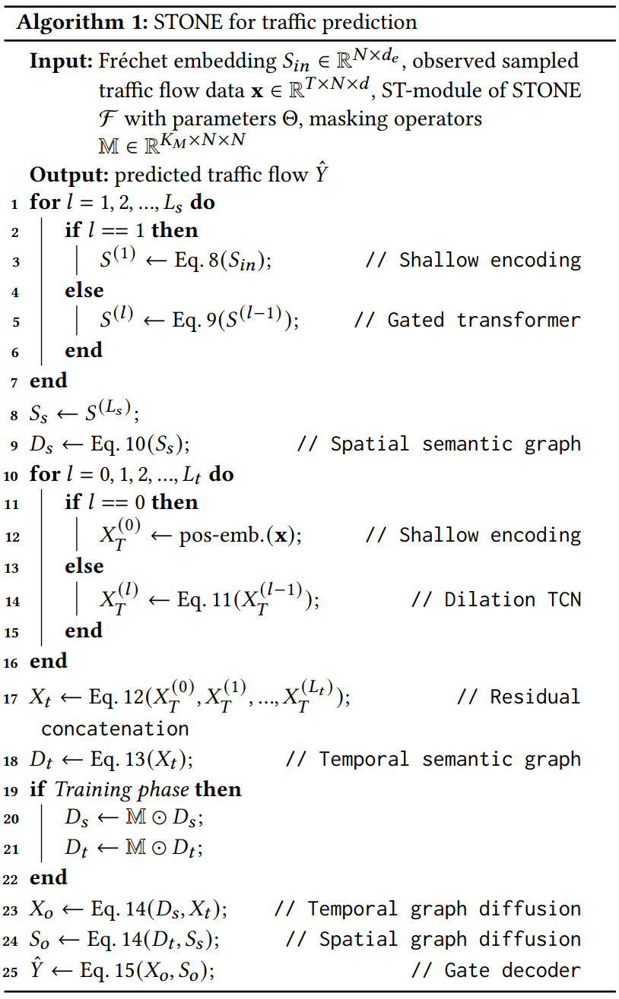

# STONE: A Spatio-temporal OOD Learning Framework Kills Both Structural and Temporal Shifts (KDD 2024)
This is the official repository of our KDD 2024 paper. This paper represents the first comprehensive investigation into the traffic prediction considering both
temporal and spatial shifts. We propose a novel spatio-temporal OOD-network framework with Fréchet Embedding called STONE. STONE effectively models spatial heterogeneity and generates temporal and spatial semantic graphs. Additionally, we introduce a graph perturbation mechanism to enhance the model’s environmental modeling capability for better generalization. We implement extensive experiments on both datasets with spatio-temporal shifts and datasets only with temporal shift, and results demonstrate that STONE achieves competitive performance in terms of both generalization and scalability. 
<br>
<!--
For rebuttal, we will show the pseudo-code for <b>the Fréchet embedding computation</b> in the STONE model, <b>joint tuning in the training phase</b> and <b>the computation framework</b> of the STONE model, respectively.
-->
We show the pseudocode for the main algorithms, including <b>the Fréchet embedding process</b>, <b>STONE forward process</b>, and <b>the training process of STONE</b>. We will add it to the new version for a clear presentation.




## 1. Introduction about the datasets
### 1.1 Generating the SD and GBA sub-datasets from CA dataset
In the experiments of our paper, we used SD and GBA datasets with years from 2019 to 2021, which were generated from CA dataset, followed by [LargeST](https://github.com/liuxu77/LargeST/blob/main). For example, you can download CA dataset from the provided [link](https://www.kaggle.com/datasets/liuxu77/largest) and please place the downloaded `archive.zip` file in the `data/ca` folder and unzip the file. 

First of all, you should go through a jupyter notebook `process_ca_his.ipynb` in the folder `data/ca` to process and generate a cleaned version of the flow data. Then, please go through all the cells in the provided jupyter notebooks `generate_sd_dataset.ipynb` in the folder `data/sd` and `generate_gla_dataset.ipynb` in the folder `data/gla` respectively. Finally use the commands below to generate traffic flow data for our experiments. 
```
python data/generate_data_for_training.py --dataset sd_gba --years 2019_2020_2021
```
Moreover, you can also generate the other years of data, as well as the two additional remaining subdatasets. 

### 1.2 Generating the additional PM2.5 Knowair dataset
We implement extra experiments on [Knowair](https://github.com/shuowang-ai/PM2.5-GNN). For example, you can download Knowair dataset from the provided [link](https://drive.google.com/file/d/1R6hS5VAgjJQ_wu8i5qoLjIxY0BG7RD1L/view) and please place the downloaded `Knowair.npy` file in the `Knowair` folder and complete the files in the `Knowair/data` folder.

<br>

## 2. Environmental Requirments
The experiment requires the same environment as [LargeST](https://github.com/liuxu77/LargeST/blob/main), and need to add the libraries mentioned in the requirements in [Knowair](https://github.com/shuowang-ai/PM2.5-GNN).

<br>

## 3. Model Running
To run STONE on <b>LargeST</b>, for example, you may execute this command in the terminal:
```
bash experiments/stone/run.sh
```
or directly execute the Python file in the terminal:
```
python experiments/stone/main.py --device cuda:0 --dataset SD --years 2019 --model_name stone --seed 0 --bs 64
```
To run STONE on <b>Knowair</b>, you may directly execute the Pyhon file in the terminal:
```
python Knowair/train.py
```
